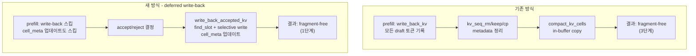

# Fragment-free KV Cache Update — Selective Write-back

## 핵심 아이디어

`shard.prefill_alloc->bindings()`의 output KV 버퍼(`v_outputs`/`k_outputs`)는 `qnn_decode` 반환 후에도 **영구적으로 유효**하다. 이를 활용해 write-back을 accept/reject 결정 이후로 지연하고, accepted 토큰만 선택적으로 기록한다.

## 기존 방식 vs 새 방식




## 메모리 Write 비교


|                               | 기존                                  | 새 방식                  |
| ----------------------------- | ----------------------------------- | --------------------- |
| output→input write            | n_draft_tree × head_dim             | n_accepted × head_dim |
| input→input copy (compaction) | n_accepted × head_dim               | **없음**                |
| seq metadata 연산               | kv_seq_rm/keep/cp (각 O(cache_size)) | **없음**                |
| **총 write**                   | **(n_draft_tree + n_accepted) × …** | **n_accepted × …**    |


Llama 8B 기준 (n_draft_tree≈30, n_accepted≈4): **~544 KB → ~64 KB/step (약 8.5배 절감)**

## 전제 조건: 단일 청크 보장

`shard.prefill_alloc->bindings()`의 output은 **마지막 청크 실행분만** 유효하다.

- 보장 조건: `batch_tgt.n_tokens ≤ prefill_ar_len`_
- 즉 `1 + n_seq_dft × n_draft_max ≤ prefill_ar_len_`
- 위반 시: 자동으로 기존 방식(정상 write-back)으로 fallback

## Attention Mask 정확성

deferred 모드에서 prefill 시 cell_meta 업데이트를 스킵해도 attention mask는 정확하다:

- **Past KV** `[0..cache_len-1]`: 이전 스텝의 accepted 토큰 (cell_meta에 이미 반영됨) ✓
- **Current AR** `[cache_len..ctx_len-1]`: draft tree 내 tree attention은 seq_id intersection으로 처리 (cell_meta 불필요) ✓

## 구현 세부 사항

### 1. Config 플래그

[llm_decode_runner.h](src/QNN/llm_decode_runner.h) `LLMDecodeConfig`에 추가:

```cpp
bool kv_deferred_writeback = false;  // Deferred KV write-back: write only accepted tokens
```

### 2. LLMKVCacheManager::write_back_kv_selective

[llm_kv_cache_manager.h](src/QNN/llm_kv_cache_manager.h) / [llm_kv_cache_manager.cpp](src/QNN/llm_kv_cache_manager.cpp):

```cpp
void write_back_kv_selective(
    const std::vector<void*>& v_outputs,
    const std::vector<void*>& k_outputs,
    int32_t                   slot,          // find_slot(n_accepted) 결과
    const int32_t*            src_indices,   // accepted tokens의 output buffer 내 index
    int32_t                   n_accepted,
    int32_t                   cache_len,
    int32_t                   ar_len,
    int32_t                   shard_layer_base
);
```

내부 로직 (기존 `write_back_kv`와 비교):

```cpp
// V layout: [ar_len, head_dim] — sequential
// 기존: src = v_output + i * head_dim (연속)
// 신규: src = v_output + src_indices[i] * head_dim (선택)
for (int i = 0; i < n_accepted; ++i) {
    memcpy(v_input + (slot+i)*head_dim,
           v_output + src_indices[i]*head_dim, head_dim);
}

// K layout: [head_dim, ar_len] — strided
// 기존: src col = i (연속)
// 신규: src col = src_indices[i] (선택)
for (int dim = 0; dim < head_dim; ++dim) {
    k_input[dim * cache_len + (slot+i)] = k_output[dim * ar_len + src_indices[i]];
}
```

### 3. run_multi_context_prefill deferred 모드

[llm_decode_runner_multi_context.cpp](src/QNN/llm_decode_runner_multi_context.cpp):

```cpp
// 단일 청크 조건 체크
bool use_deferred = config_.kv_deferred_writeback && (batch.n_tokens <= prefill_ar_len_);

// 기존 write_back_kv + cell_meta 업데이트 블록을 조건부로 스킵
if (!use_deferred) {
    // 기존 write_back_kv 호출
    kv_manager_->write_back_kv(...);
    // cell_meta 업데이트
    for (int i = 0; i < chunk_size; ++i) { ... }
}
// deferred 모드: 두 블록 모두 스킵 (find_slot도 불필요)
```

### 4. LLMDecodeRunner::write_back_accepted_kv

[llm_decode_runner.h](src/QNN/llm_decode_runner.h)에 선언, multi_context.cpp에 구현:

```cpp
bool write_back_accepted_kv(
    const std::vector<int32_t>& accepted_batch_indices, // batch_tgt 내 인덱스
    const llama_batch&          batch                   // pos, seq_id 정보
);
```

내부 흐름:

```
1. find_slot(n_accepted)
2. for each shard:
      v_outputs, k_outputs = shard.prefill_alloc->bindings()에서 재수집
      write_back_kv_selective(v_outputs, k_outputs, slot, accepted_indices, ...)
3. cell_meta 업데이트 (accepted 토큰의 pos, seq_id=0)
```

### 5. Example 수정

[speculative-qnn.cpp](examples/speculative-qnn/speculative-qnn.cpp)와 [speculative-eagle-qnn.cpp](examples/speculative-eagle-qnn/speculative-eagle-qnn.cpp):

```cpp
// 기존 QNN KV 관리 (naive 방식, unchanged for draft model)
llama_memory_seq_keep(mem_dft, s_keep);
llama_memory_seq_cp  (mem_dft, s_keep, 0, -1, -1);
llama_memory_seq_keep(mem_dft, 0);

// QNN target model KV 관리 교체
if (qnn_config.kv_deferred_writeback) {
    std::vector<int32_t> accepted_indices;
    accepted_indices.push_back(0);  // seed token (batch index 0)
    for (int d = 0; d < i_dft; ++d) {
        accepted_indices.push_back(drafts[s_keep].i_batch_tgt[d]);
    }
    qnn_runner.write_back_accepted_kv(accepted_indices, batch_tgt);
} else {
    // 기존 naive 방식
    qnn_runner.kv_seq_rm  (s_keep, n_past_tgt, -1);
    qnn_runner.kv_seq_keep(s_keep);
    qnn_runner.kv_seq_cp  (s_keep, 0, -1, -1);
    qnn_runner.kv_seq_keep(0);
}
```

### 6. CLI 파라미터

[common.h](common/common.h)에 `bool qnn_kv_deferred_writeback = false` 추가,
[arg.cpp](common/arg.cpp)에 `--qnn-kv-deferred` 플래그 등록.

## 수정 파일 요약

- `src/QNN/llm_kv_cache_manager.h` — `write_back_kv_selective` 선언
- `src/QNN/llm_kv_cache_manager.cpp` — `write_back_kv_selective` 구현
- `src/QNN/llm_decode_runner.h` — config 필드, `write_back_accepted_kv` 선언
- `src/QNN/llm_decode_runner_multi_context.cpp` — deferred 모드 분기, `write_back_accepted_kv` 구현
- `examples/speculative-qnn/speculative-qnn.cpp` — 교체
- `examples/speculative-eagle-qnn/speculative-eagle-qnn.cpp` — 교체
- `common/common.h` + `common/arg.cpp` — CLI 파라미터

